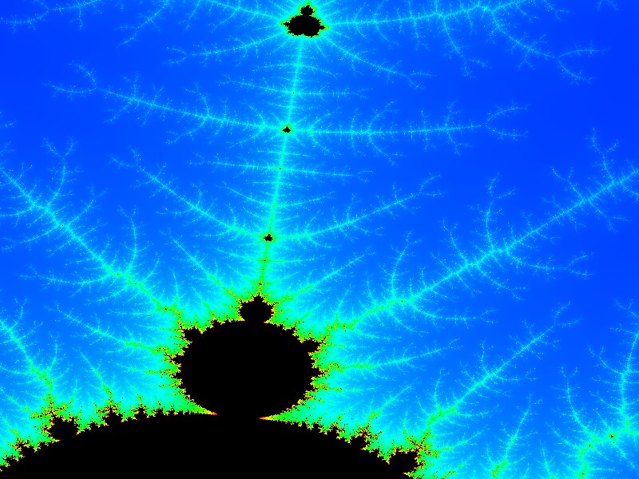
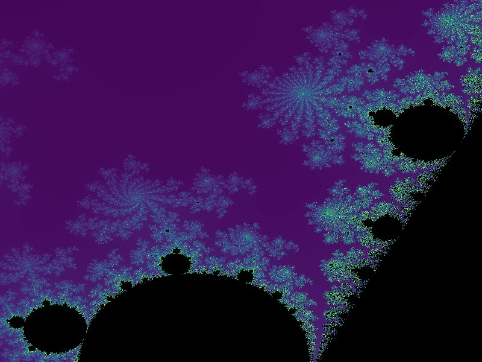
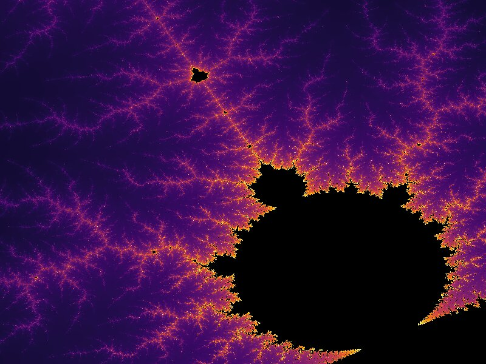

# Mandelbrot

Visualization of the Mandelbrot fractal with OpenGL.

Color maps taken from https://blog.habrador.com/2023/04/colormaps-overview-code-implementations-rainbow-virids.html and https://github.com/BIDS/colormap/blob/master/colormaps.py.

All dependencies are downloaded and compiled via cmake's FetchContent (see https://jonathanhamberg.com/post/2019-01-27-cmake-dependencies-fetch-content/ for glad library).

## Commands

- <kbd>ESC</kbd> close application
- <kbd>h</kbd> move left
- <kbd>l</kbd> move right
- <kbd>j</kbd> move down
- <kbd>k</kbd> move up
- <kbd>m</kbd> zoom in
- <kbd>n</kbd> zoom out
- <kbd>c</kbd> reset
- <kbd>space</kbd> change color map (on release)

## Build

```shell
mkdir build
cd build
cmake ..
make
```

## Run

From the build directory:

```shell
./mandelbrot ../shaders
```




